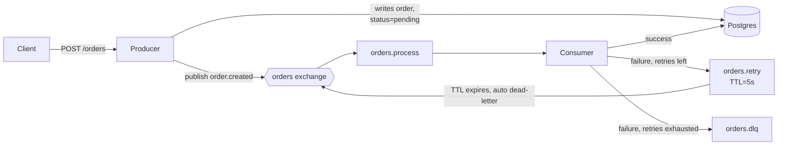

# Order Processing Pipeline — Event-Driven, RabbitMQ

A producer and consumer, decoupled by a real message queue, with the two
things that actually matter in an at-least-once delivery system: retries
don't spin forever, and redelivery doesn't double-process. Not a toy
"hello world" queue demo — the idempotency here is the same pattern
already proven in [Rate-Limited-API-Gateway](https://github.com/saijignas/Rate-Limited-API-Gateway),
applied on the write path instead of a cache read path.

**Stack:** Python, FastAPI, RabbitMQ, PostgreSQL, Docker, Kubernetes.

## Architecture



- **Idempotent producer**: a client retrying a `POST /orders` (e.g. after
  a timeout where it never saw the response) sends the same
  `Idempotency-Key` header. A repeat key returns the *existing* order
  instead of creating a duplicate.
- **Idempotent consumer**: before doing any work, the consumer checks the
  order's current status in Postgres. If it's already `completed`, the
  handler returns immediately with no side effects. This is what
  actually matters under at-least-once delivery: if the consumer commits
  the DB update but crashes before acking the message, RabbitMQ
  redelivers it. Without this check, that redelivery would reprocess
  (in a real system: double-charge, double-ship) an already-completed
  order.
- **Retry with delay, not a spin loop**: a failed order isn't nacked
  back onto the main queue (which would retry with no delay and burn
  CPU). It's published to `orders.retry`, which holds it for 5 seconds
  via a per-queue TTL, then RabbitMQ's own dead-letter mechanism
  automatically routes it back to the main queue. After `MAX_RETRIES`
  (3) failed attempts, it goes to `orders.dlq` instead and the order is
  marked `failed` — a human has to look at it; nothing auto-retries out
  of the DLQ.

## Testing discipline

Every test runs against a real Postgres and a real RabbitMQ (via
GitHub Actions service containers), not mocks — including a full
round-trip test that publishes to the actual queue, pulls the message
back off it, and runs it through the real message handler, which is
what actually proves the exchange/routing-key/header wiring works
rather than just the Python logic in isolation.

| What's tested | How |
|---|---|
| Idempotent order creation | Same `Idempotency-Key` twice → same order ID |
| Idempotent consumer | An order already `completed`, redelivered → no-op, no reprocessing |
| Retry-then-recover | `simulate_failures=2` fails twice, succeeds on the 3rd attempt |
| DLQ after exhausting retries | `simulate_failures` set high enough → ends at `orders.dlq`, order marked `failed` |
| Real queue round-trip | Publish for real, `basic_get` it back, run it through the real handler |

`simulate_failures` is a testing-only field on order creation (disclosed
here, not hidden) that forces the consumer to fail a set number of times
before succeeding — without it, retry/DLQ behavior would only be
observable by waiting for real, unpredictable flakiness.

## Deployment

Kubernetes manifests (`k8s/`) run the whole pipeline — Postgres,
RabbitMQ, producer, and consumer, each independently scalable — on a
single free-tier AWS EC2 instance running **k3s** (a lightweight, still
CNCF-certified Kubernetes distribution). That's a deliberate cost
choice over AWS's managed EKS, whose control plane alone runs
~$73/month regardless of usage — not something to leave running for a
portfolio project. Postgres and RabbitMQ run inside the cluster too
(not a managed RDS/Amazon MQ instance), so the entire stack fits on one
node.

**Status: manifests are written and reviewable; live deployment is
pending AWS account setup.** This section will be updated with the
actual cluster once that's live — disclosed here rather than silently
leaving the README implying something that isn't running yet.

## Limitations

- "Inventory check" and "payment" in the consumer are deterministic
  stand-ins, not real integrations — the point of this project is the
  delivery/retry/idempotency guarantees around processing, not a
  payment gateway.
- Single RabbitMQ node, no clustering/mirrored queues — a real
  production deployment handling money would want queue mirroring so a
  broker restart doesn't risk in-flight messages; out of scope here.
- The retry queue's TTL (5s) is fixed, not exponential backoff — simpler
  to reason about and to make observable in tests quickly; a real system
  processing high-value orders might want backoff that grows with
  `x-retry-count`.

## How to run locally

```bash
docker compose up --build
# Producer: http://localhost:8000
# RabbitMQ management UI: http://localhost:15672 (guest/guest)

curl -X POST http://localhost:8000/orders \
  -H "Content-Type: application/json" \
  -H "Idempotency-Key: demo-1" \
  -d '{"customer_id": "cust-1", "items": [{"sku": "WIDGET-1", "quantity": 2}]}'
```

## Files

```
producer/app.py       # FastAPI: POST /orders, GET /orders/{id}
consumer/worker.py     # RabbitMQ consumer: processes orders, retry/DLQ routing
shared/
  models.py            # SQLAlchemy Order model (shared by both processes)
  rabbitmq.py           # exchange/queue topology, publish helpers
  init_db.py            # creates tables
tests/
  conftest.py           # real Postgres + RabbitMQ fixtures
  test_producer.py       # API + idempotent creation + real-queue publish
  test_consumer.py       # process_order() logic + real-queue round-trip
k8s/                    # Kubernetes manifests (k3s target, see Deployment above)
docker-compose.yml      # local dev: Postgres + RabbitMQ + both services
```
